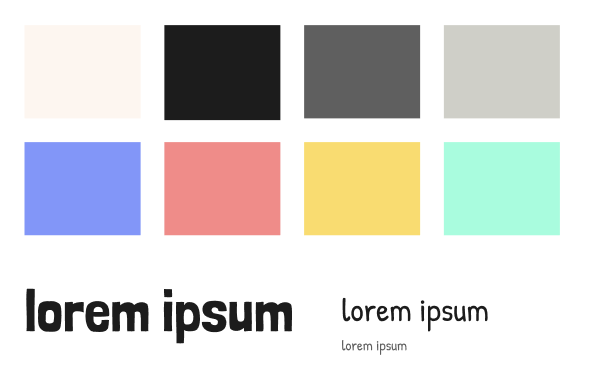
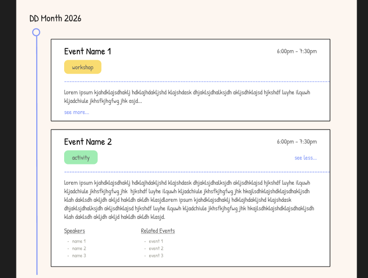
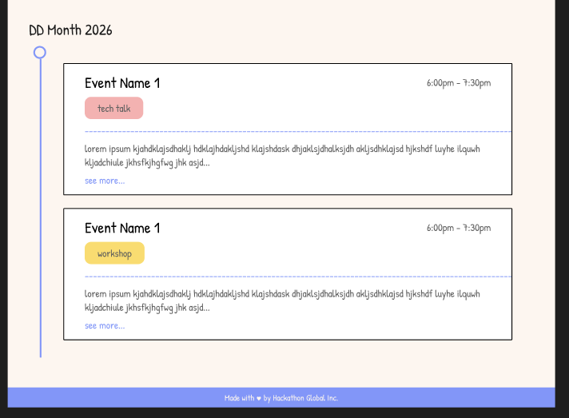

# Pre-development

1. Started by stating out requirements for the UI:
    - Login
    - Each event:
      - name
      - event type
      - start & end time
      - description (truncated)
      - Show more (expand):
        - extended description
        - speakers
        - related events
    - Sorting:
      - by time
      - Bonus: search for name
      - Bonus: by event type
      - Bonus: event reordering, persist across refresh
2. Research existing solutions:
    - Luma (very cutesy, modular, notion vibes)
    - Eventbrite (basic, kinda ugly)
    - Meetup (eventbrite copy, but cuter, more sketchy)
3. Synthesize themes:
    - I want something that has the "sketching" aesthetics Meetup features, but a cooler, modern vibe like Luma.
    - Sharp rectangular sketched frames for each event
    - Doodly but still readable font
    - White/paper background, pops of color, not too colorful though
    - Bonus: bubbly color animation on hover
4. Design!

    Initial sketches:</br>

    **Styles:**</br>
    

    Figma prototypes:</br>
    

# Initial Setup

I decided to use React + Tailwind.

**Create standard classes for easy Tailwind**
```css
  --white: #FFF6EF;
  --black: #1C1C1C;
  --gray-1: #5F5F5F;
  --gray-2: #A2A298;
  --blue: #7D97FF;
  --red: #FFAFAF;
  --yellow: #FFDB5C;
  --green: #87EEAE;

  .hero-title {
    font-family: "Londrina Solid", sans-serif;
    font-weight: 900;
    font-size: 8rem;
  }

  .title {
    font-family: "Londrina Solid", sans-serif;
    font-size: 3rem;
  }

  .big-text {
    font-family: "Patrick Hand", cursive;
    font-size: 2rem;
  }

  .normal-text {
    font-family: "Patrick Hand", cursive;
    font-size: 1.5rem;
  }

  .small-text {
    font-family: "Patrick Hand", cursive;
    font-size: 1rem;
  }
```
