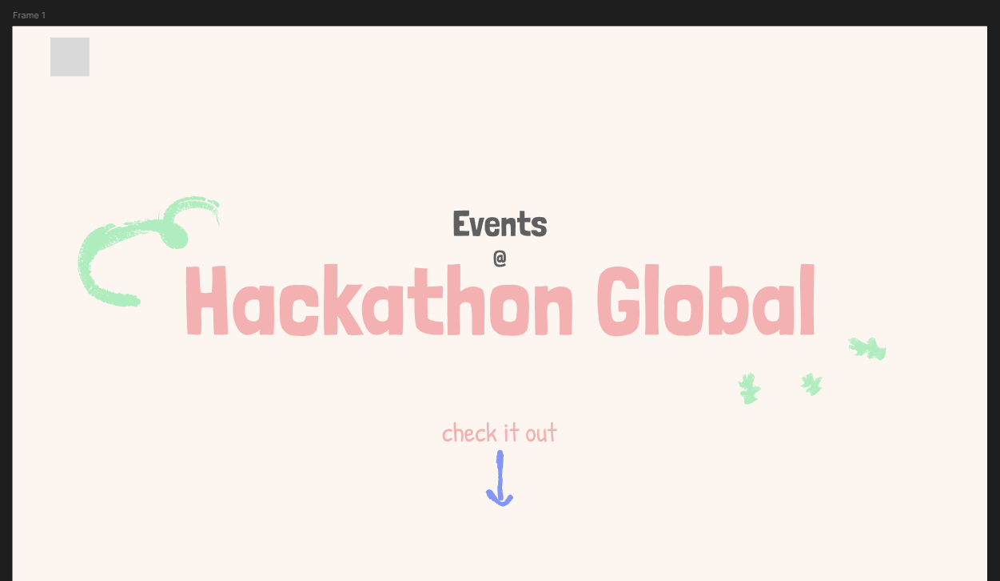
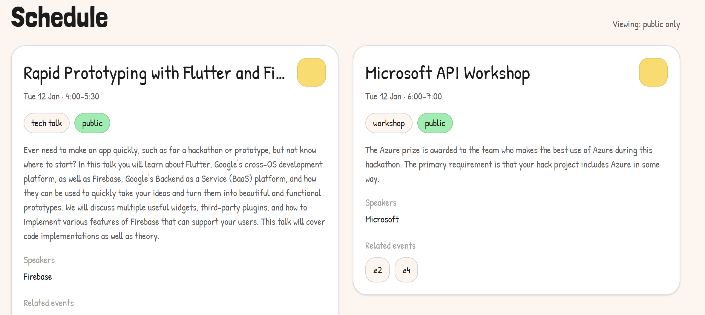
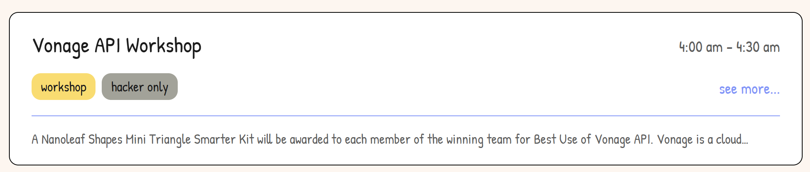
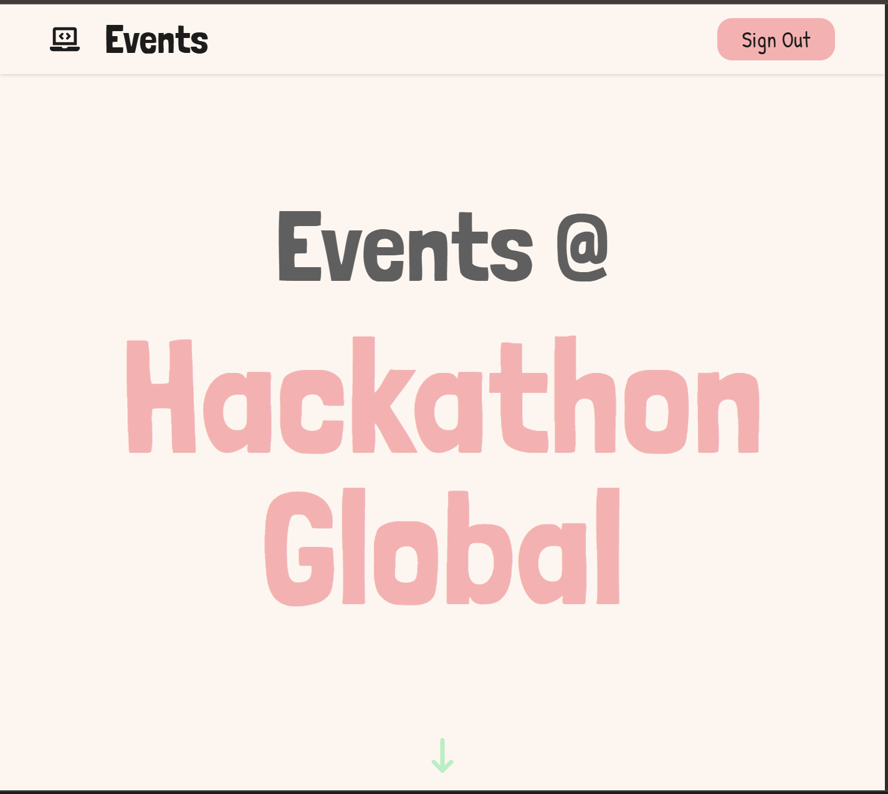
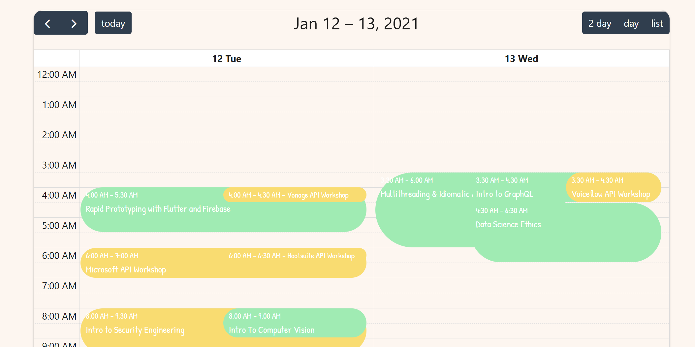
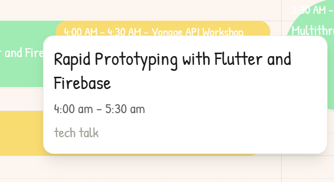
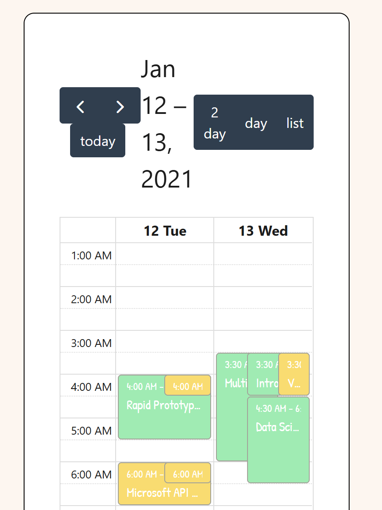
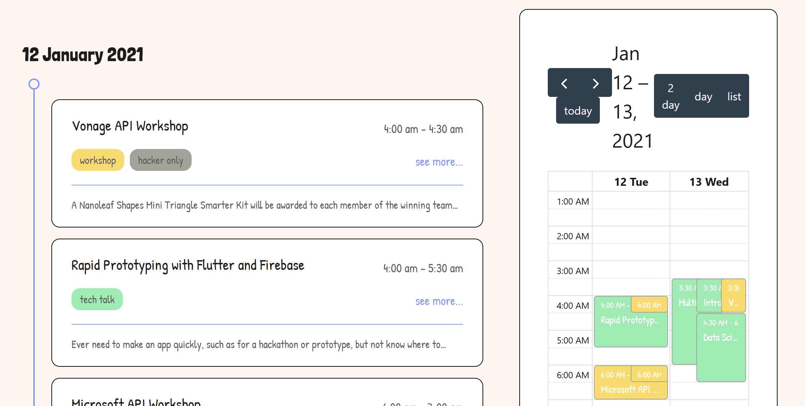
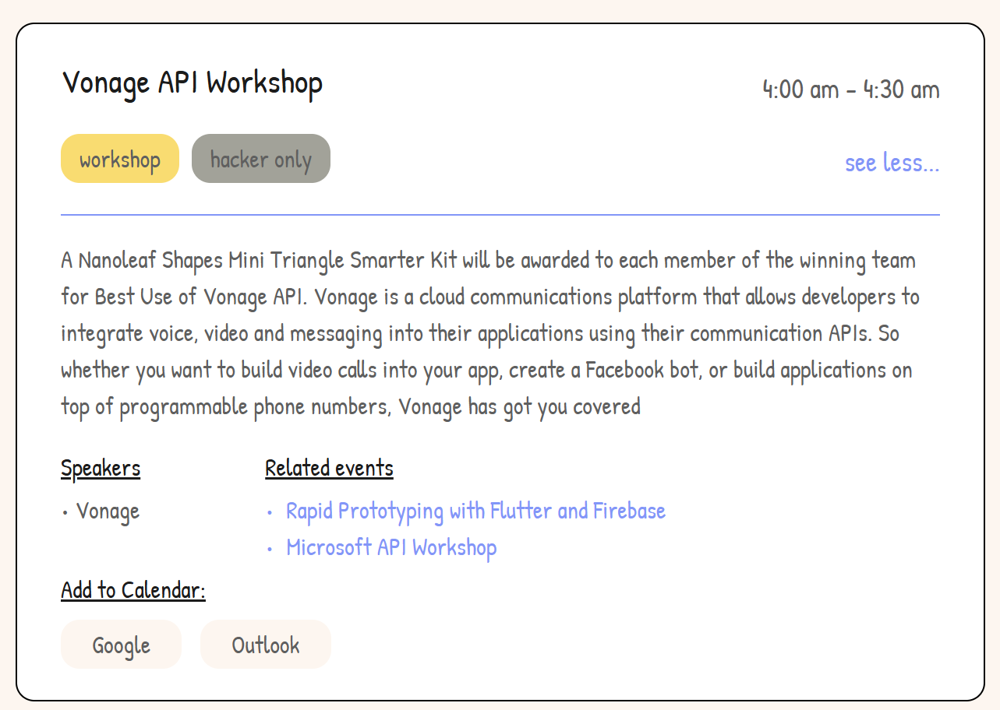

# HTN Writeup Questions

## 1.

1. Started by stating out requirements for the UI:
    - Login
    - Each event:
      - name
      - event type
      - start & end time
      - description (truncated)
      - Show more (expand):
        - extended description
        - speakers
        - related events
    - Sorting:
      - by time
      - Bonus: search for name
      - Bonus: by event type
2. Research existing solutions:
    - Luma (very cutesy, modular, notion vibes)
    - Eventbrite (basic, kinda ugly)
    - Meetup (eventbrite copy, but cuter, more sketchy)
3. Synthesize themes:
    - I want something that has the "sketching" aesthetics Meetup features, but a cooler, modern vibe like Luma.
    - Sharp rectangular sketched frames for each event
    - Doodly but still readable font
    - White/paper background, pops of color, not too colorful though
    - Bonus: bubbly color animation on hover
4. Design!

    **Initial sketches:**</br>
    

    **Styles:**</br>
    

    **Figma prototypes:**</br>
    


I decided to use JS/React & Tailwind CSS for the bulk of the website since it's the most common framework and very easy to use, especially in a time crunch! JS was chosen over TS because it's faster and for the scope of the project, TS is overkill (although if this was a part of a bigger project & development was to continue on it, I would have chosen TS).

Additionally, I used Motion, react-icons, fontsource, and FullCalendar. Motion was non-negotiable for the mini scrolling animation I wanted, react-icons are always helpful to have on hand, fontsource for standardized font sourcing, and FullCalendar to make implementing a calendar much much easier.

Fortunately, I never came across a blocking problem when developing this website. With some minor investigations and help from AI, I was able to solve *most problems. Here's some problems I came across: [Problems I Came Across](#problems-i-came-across)

My favourite part of the website is definitely the calendar integration! I think it looks cute and visualization is never really a bad thing. I also learned to use a new library/technology while building it so that was super fun.

## 2. 
Given more time, I would implement a fuzzy search engine for the events. I would also optimize the performance by looking at reducing useEffects or adding memos and/or refs. I'd like to allow persistent sign-ins across reloads and reduce GraphQL fetches by caching results. Animations would also be fun to add for after signing in, loggin out, clicking on things, etc.

Metrics wise, I'd want to look at render/re-render frequency, time until full loaded, input delay, and FPS when scrolling. With the implementation of cached fetches, over-fetching shouldn't be a problem but it would also be nice to see that as a metric. Lastly, it would be important to log errors and failures in development.

## 3.
Reflecting on the considerations for this project, I wanted to make sure that the code is very easily scalable and maintainable. One key way of doing this was keeping event fetching & processing purely hands-off. Given more event types in the future, the code will default to a neutral tones until manually added into a centralized location `src\utils\eventInfoProcessing.js`. Event filtering is also generated dynamically as a set from the data.
```javascript
const EVENT_TYPE_TONES = {
  "workshop": "yellow",
  "activity": "red",
  "tech talk": "green",
};
```

The website is fully responsive on all screen sizes (hopefully) by using custom css. [Read more here](#responsiveness)
Here's some considerations on [accessibility](#accessibility)

Lastly, documentation. Unfortunately I did not comment most lines of code. However, I tried to write, format, and organize my code & styling in a way that was readable. Most things are in chronological order based on importance of parent-child relationships. I did get AI to go in and add a few sparring lines of comments with the intent of certain code blocks.

# Documented Development Process >w<

## Initial Setup
**Create standard classes for easy Tailwind**
```css
  --white: #FFF6EF;
  --black: #1C1C1C;
  --gray-1: #5F5F5F;
  --gray-2: #A2A298;
  --blue: #7D97FF;
  --red: #FFAFAF;
  --yellow: #FFDB5C;
  --green: #87EEAE;

  .hero-title {
    font-family: "Londrina Solid", sans-serif;
    font-weight: 900;
    font-size: 8rem;
  }

  .title {
    font-family: "Londrina Solid", sans-serif;
    font-size: 3rem;
  }

  .big-text {
    font-family: "Patrick Hand", cursive;
    font-size: 2rem;
  }

  .normal-text {
    font-family: "Patrick Hand", cursive;
    font-size: 1.5rem;
  }

  .small-text {
    font-family: "Patrick Hand", cursive;
    font-size: 1rem;
  }
```

I started by creating a basic skeleton of the site using AI, feeding it my Figma designs as a reference. I was able to get this:


This was far from what I envisioned for this site. Here's what I needed to work on next:
1. Fix the styling for each of the cards
2. Allow collapse & expand
3. Separate by date

Some things I also wanted to optimize were:
1. Minimize GraphQL re-fetch on reload
2. Persistent login across reload

## Component Development
### Event cards!


Putting it all together:


After staring at it for a bit, the round edges became a more appealing idea:


### Login Page

I started by hardcoding the login credentials and used a "useAuth" hook to validate login status. It started off by being really simple comparison: "does the username & password matching hardcoded values?" The login was a simple button at top right, where it pops up a window on click.


I also added error checking & disabled the button if the input is not filled.

### Hero Page


I wanted something simple and clutter free. Also, I'm a fan of the scroll hinting animations a lot of sites so I implemented that with the bottom arrow using Motion.

## Problems I Came Across

### Related Events Scrolling
When clicking on "related events" and scrolling up to them, the header would appear and obstruct the view. I ended up having to suppress the header and adding idle frames when scrolling using the eventCards.

However, this also felt unatrual when scrolling down. It made more sense to hide the header on down scroll and keep it hidden on up scroll. The solution was to use `id` as a comparison for up vs. down scroll and setting idle frames accordingly. 

Initially, the related event would animate a "pop" after arriving. But this looked awkward. Instead, I decided to simply expand the box after landing. This meant passing in an argument into `EventCard.jsx` to forcibly expand it.

### Hero Doodle Placements
Since the doodles are placed absolutely, it's very hard to get it placed responsively along with the text. I decided to disable it on smaller screens for the time being because it would be a lot of work. There are definitely more important priorities, but it's worth coming back to if given more time...

## Responsiveness

### Text
Only the hero text really had to be resized. I split it into 3 different sizes:
```css
@media (max-width: 640px) {
  .hero-title {
    font-size: 7rem;
  }
  .hero-text {
    font-size: 4rem;
  }
}

@media (max-width: 580px) {
  .hero-title {
    font-size: 5.75rem;
  }
  .hero-text {
    font-size: 3.5rem;
  }
}
```



For all other text, I made them somewhat smaller to decrease clutter on smaller screens. For large screens, I added max-width to the cards. This was the only necessary change since everything was already centered.

### Event Formatting
With the addition of the calendar, the way events stack needs to be changed.

1. When the screen is small enough, stack the list on top of the calendar
2. Expand the lists to fill up the screen and center everything
3. Remove rail on small screens

## Accessibility
After completing development, I spent some time going back to each file to make the website more accessible. Some key considerations:
- Keyboard navigation using tab & enter
- Alt text or aria-labels

Components such as the event cards needed a lot of improvement in terms of keyboard navigation since it can't be expanded with a keyboard. For these components, I added custom keyboard navigation scripts to allow the use of tabs for switching focuses.

## Bonuses

Other fun functionalities I added :)

### Event Type Filtering
Since the fetch & sorting happens in `App.jsx`, I added a dropdown to also filter events by type in addition to permissions. 

Keeping scalability in mind, the event types in the dropdown are generated dynamically from the data.


I also realized private-only filtering might also be useful, so I implemented that as well.

### Event Calendar
Huge fan of seeing timelines visually displayed on actual calendars to see overlaps, so I knew I had to implement a calendar! Since this is a 2-day hackathon, the default time window was 2 days displayed over 24 hours. I chose to use the [FullCalendar](https://fullcalendar.io/) library to simplify creating this from scratch. 

Something cool I learned while working on this is React Fragments.

Initial iteration:



Clearly a lot of work to be done on the UI.



Combined with the event list:


I also wanted the function to export events onto Google & Outlook calendars. Decided to display this in the expanded list view as 2 different buttons:


For the sake of time, the view had to be locked onto just the 2 days unfortunately because most events in the endpoint just happened to be on those 2 days.
